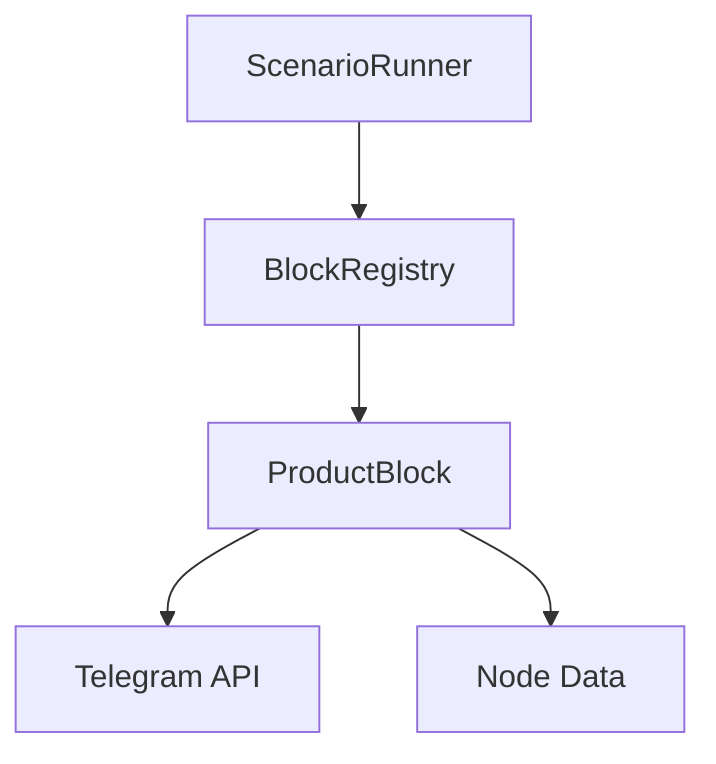
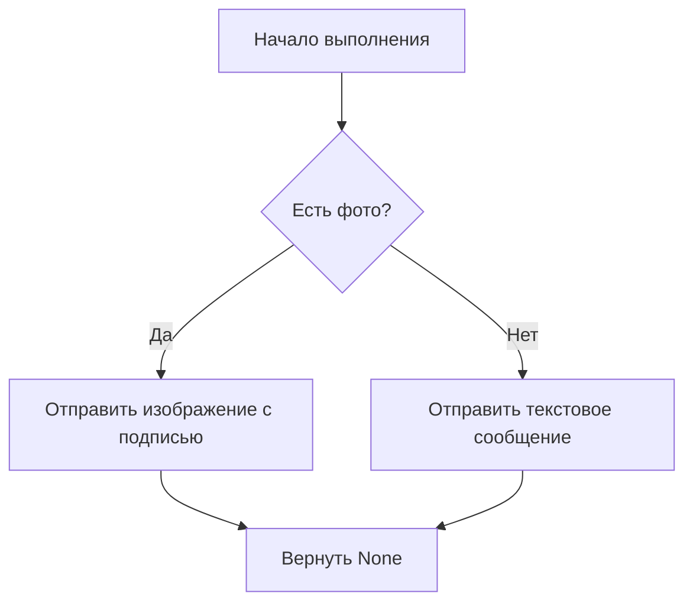
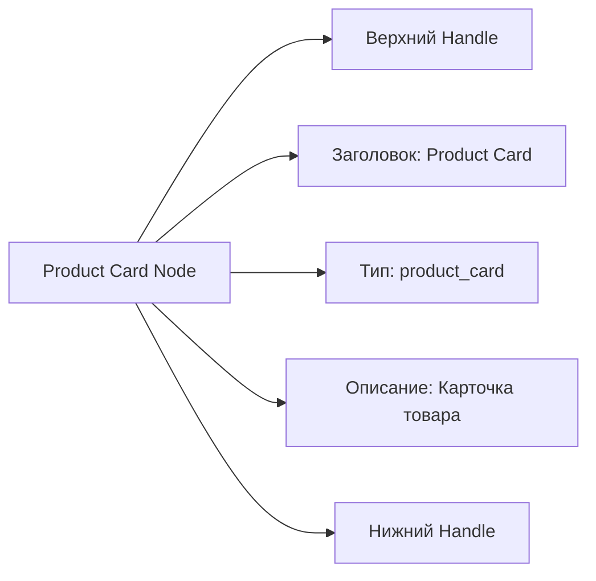

# Дизайн блока "Карточка товара"

## 1. Обзор

Блок "Карточка товара" предназначен для отображения информации о товаре в Telegram-боте. Пользователь может добавить в блок следующую информацию:
- Фото товара
- Описание товара
- Стоимость товара
- Характеристики товара

Блок будет реализовывать функциональность отображения карточки товара с возможностью настройки всех параметров через интерфейс редактора бота.

## 2. Архитектура

### 2.1. Структура блока

Блок будет реализован как новый класс, наследующийся от `BaseBlock`, и будет зарегистрирован в `BlockRegistry`.

### 2.2. Технические характеристики

- Тип блока: `product_card`
- Расположение файла: `blocks/product_block.py`
- Класс: `ProductBlock`
- Регистрация: В `core/block_registry.py`

### 2.3. Диаграмма архитектуры



## 3. API блока

### 3.1. Метод get_block_type

```python
@staticmethod
def get_block_type() -> str:
    return "product_card"
```

### 3.2. Метод execute

```python
def execute(self, bot: telebot.TeleBot, chat_id: int, **kwargs) -> Optional[str]:
    # Реализация логики блока
    pass
```

## 4. Модель данных

### 4.1. Структура данных узла

```json
{
  "id": "product_1",
  "type": "product_card",
  "data": {
    "photo_url": "https://example.com/product.jpg",
    "title": "Название товара",
    "description": "Описание товара",
    "price": "999 руб.",
    "features": [
      {"key": "Цвет", "value": "Красный"},
      {"key": "Размер", "value": "M"}
    ]
  },
  "position": {"x": 100, "y": 100}
}
```

### 4.2. Пример заполненных данных

```json
{
  "id": "product_abc123",
  "type": "product_card",
  "data": {
    "photo_url": "https://shop.example.com/images/phone.jpg",
    "title": "Смартфон XYZ-2000",
    "description": "Мощный смартфон с отличной камерой и долгим временем работы",
    "price": "24990 руб.",
    "features": [
      {"key": "Экран", "value": "6.7 дюймов, OLED"},
      {"key": "Процессор", "value": "Octa-core 2.8 ГГц"},
      {"key": "Память", "value": "128 ГБ"},
      {"key": "Камера", "value": "48 МП + 12 МП + 8 МП"}
    ]
  }
}
```

### 4.2. Таблица полей данных

| Поле | Тип | Обязательное | Описание |
|------|-----|--------------|----------|
| type | string | Да | Тип блока ("product_card") |
| data.photo_url | string | Нет | URL фотографии товара |
| data.title | string | Нет | Название товара |
| data.description | string | Нет | Описание товара |
| data.price | string/number | Нет | Стоимость товара |
| data.features | array of objects | Нет | Характеристики товара |
| data.features[].key | string | Нет | Название характеристики |
| data.features[].value | string | Нет | Значение характеристики |


## 5. Бизнес-логика

### 5.1. Форматирование данных

Блок будет форматировать данные в виде структурированного сообщения с использованием возможностей Telegram:
- Фотография товара будет отправляться как изображение с подписью
- Если фото отсутствует, будет отправлено текстовое сообщение
- Информация будет структурирована с использованием Markdown разметки

### 5.2. Логика выполнения



### 5.3. Формат сообщения

Сообщение будет форматироваться следующим образом:

```
Название товара

Описание товара

Цена: 999 руб.

Характеристики:
• Цвет: Красный
• Размер: M
```

### 5.4. Реализация метода execute

```python
def execute(self, bot: telebot.TeleBot, chat_id: int, **kwargs) -> Optional[str]:
    try:
        # Извлечение данных
        data = self.node_data.get('data', {})
        photo_url = data.get('photo_url', '')
        title = data.get('title', '')
        description = data.get('description', '')
        price = data.get('price', '')
        features = data.get('features', [])
        
        # Формирование текста сообщения
        message_text = self._format_product_message(title, description, price, features)
        
        # Отправка сообщения
        if photo_url:
            try:
                bot.send_photo(chat_id, photo_url, caption=message_text, parse_mode='Markdown')
            except Exception as e:
                # Отправка текстового сообщения, если фото не удалось отправить
                bot.send_message(chat_id, f"Изображение: {photo_url}\n\n{message_text}", parse_mode='Markdown')
        else:
            bot.send_message(chat_id, message_text, parse_mode='Markdown')
    except Exception as e:
        # Логирование ошибки и отправка уведомления
        logger.error(f"Ошибка в блоке product_card: {str(e)}")
        bot.send_message(chat_id, "❌ Произошла ошибка при отображении карточки товара")
    
    # Возвращаем None для передачи управления следующему блоку
    return None
```

### 5.5. Вспомогательный метод форматирования

```python
def _format_product_message(self, title: str, description: str, price: str, features: list) -> str:
    """Форматирует данные товара в текст сообщения"""
    message_parts = []
    
    # Добавляем название
    if title:
    message_parts.append(f"*{title}*\n")
    
    # Добавляем описание
    if description:
    message_parts.append(f"{description}\n")
    
    # Добавляем цену
    if price:
    message_parts.append(f"*Цена:* {price}\n")
    
    # Добавляем характеристики
    if features:
    message_parts.append("*Характеристики:*\n")
    for feature in features:
        key = feature.get('key', '')
        value = feature.get('value', '')
        if key and value:
        message_parts.append(f"• {key}: {value}\n")
    
    return "\n".join(message_parts).strip()
```

### 5.6. Обработка ошибок

Блок будет включать следующие механизмы обработки ошибок:

1. **Ошибки отправки фото**:
   - При невозможности отправить фото, система отправит текстовое сообщение с ссылкой на изображение
   
2. **Ошибки форматирования**:
   - При ошибках форматирования текста, будет отправлено простое текстовое сообщение
   
3. **Общие ошибки выполнения**:
   - При любых других ошибках будет отправлено сообщение об ошибке и запись в лог
   
4. **Пустые данные**:
   - При отсутствии данных блок корректно обработает пустые значения и отправит минимальную информацию

## 6. Интерфейс редактора

### 6.1. Компонент узла

Новый компонент `ProductNode` будет добавлен в `src/components/NodeTypes/` для отображения блока в редакторе.

### 6.2. Визуальное представление



### 6.3. Редактируемые поля

- Поле ввода для URL фотографии
- Поле ввода для названия товара
- Многострочное поле для описания товара
- Поле ввода для стоимости
- Секция для добавления характеристик (ключ-значение)

### 6.4. Пример компонента

```jsx
const ProductNode = ({ data }) => {
  return (
    <NodeContainer>
      <Handle type="target" position={Position.Top} />
      <NodeHeader>
        <span>Product Card</span>
        <NodeType>product_card</NodeType>
      </NodeHeader>
      <NodeBody>
        Карточка товара с фото и описанием
      </NodeBody>
      <Handle type="source" position={Position.Bottom} />
    </NodeContainer>
  );
};
```

### 6.5. Стили компонента

```css
.NodeContainer {
  background: #e8f5e9;
  border: 2px solid #4caf50;
  border-radius: 8px;
  padding: 10px;
  width: 200px;
  box-shadow: 0 4px 8px rgba(0, 0, 0, 0.1);
  transition: all 0.3s ease;
}

.NodeHeader {
  font-weight: bold;
  margin-bottom: 8px;
  color: #1b5e20;
  display: flex;
  align-items: center;
  justify-content: space-between;
}

.NodeType {
  font-size: 0.8em;
  background: #4caf50;
  color: white;
  padding: 2px 6px;
  border-radius: 4px;
}
```

## 7. Регистрация блока

### 7.1. Добавление в BlockRegistry

В файл `core/block_registry.py` необходимо добавить импорт и регистрацию:

```python
# Добавить импорт в существующие импорты
from blocks.product_block import ProductBlock

# Добавить в список core_blocks
ProductBlock
```

Пример обновленного участка файла:

```python
# Импортируем и регистрируем каждый блок отдельно
from blocks.message_block import MessageBlock
from blocks.image_block import ImageBlock
from blocks.button_block import ButtonBlock
# ... другие импорты ...
from blocks.product_block import ProductBlock  # <- Новый импорт

core_blocks = [
    MessageBlock,
    ImageBlock,
    ButtonBlock,
    # ... другие блоки ...
    ProductBlock,  # <- Новая регистрация
]
```

### 7.2. Добавление в NodeTypes

В файл `src/components/NodeTypes/index.js` необходимо добавить:

```javascript
// Добавить импорт
import ProductNode from './ProductNode';

// В объект nodeTypes добавить строку
product_card: ProductNode,
```

Пример обновленного участка файла:

```javascript
import StartNode from './StartNode';
import MessageNode from './MessageNode';
// ... другие импорты ...
import ProductNode from './ProductNode';  // <- Новый импорт

export const nodeTypes = {
  start: StartNode,
  message: MessageNode,
  // ... другие типы ...
  product_card: ProductNode,  // <- Новый тип
};
```

## 8. Тестирование

### 8.1. Unit-тесты

- Тест на создание блока с корректными данными
- Тест на отправку сообщения с фото
- Тест на отправку текстового сообщения без фото
- Тест на форматирование данных
- Тест на обработку пустых данных
- Тест на обработку ошибок отправки фото
- Тест на обработку некорректных данных

### 8.2. Интеграционные тесты

- Тест на корректную регистрацию блока в системе
- Тест на интеграцию с редактором блоков
- Тест на последовательность выполнения в сценарии
- Тест на обработку ошибок в цепочке блоков

### 8.3. Тесты пользовательского интерфейса

- Тест на отображение узла в редакторе
- Тест на редактирование полей
- Тест на сохранение данных узла
- Тест на валидацию вводимых данных
- Тест на отображение ошибок в интерфейсе

### 8.4. Пример unit-теста

```python
def test_product_block_with_photo():
    # Подготовка данных
    node_data = {
        "id": "test_product",
        "type": "product_card",
        "data": {
            "photo_url": "https://example.com/photo.jpg",
            "title": "Тестовый товар",
            "description": "Описание тестового товара",
            "price": "1000 руб.",
            "features": [
                {"key": "Цвет", "value": "Синий"}
            ]
        }
    }
    
    # Создание блока
    block = ProductBlock(node_data)
    
    # Проверка типа блока
    assert block.get_block_type() == "product_card"
    
    # Проверка создания экземпляра
    assert isinstance(block, ProductBlock)
```

