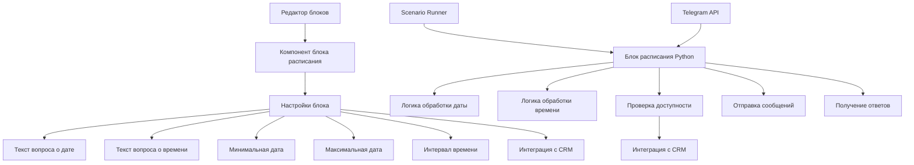
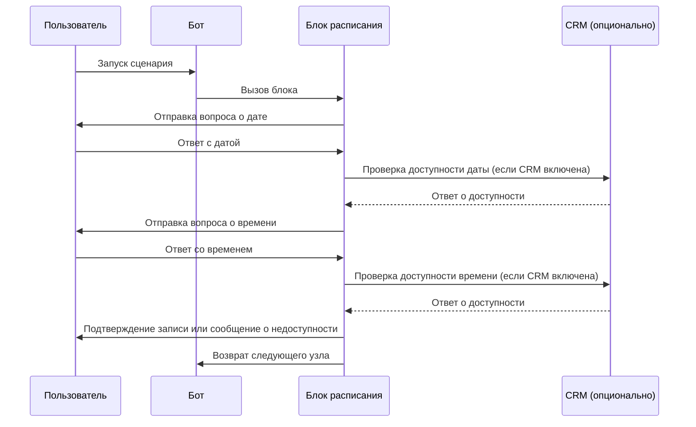
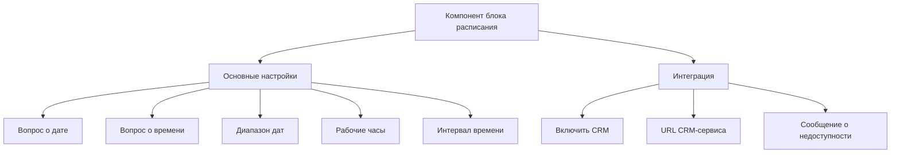

# Дизайн блока расписания для конструктора Telegram-ботов

## 1. Обзор

Блок расписания предназначен для организации записи пользователей на определенные даты и время через Telegram-бот. Блок позволяет задавать вопросы пользователю о дате и времени, проверять доступность слотов и интегрироваться с CRM-системами для получения актуальной информации о занятости.

## 2. Архитектура

### 2.1. Структура блока

Блок расписания будет состоять из следующих компонентов:

1. **Frontend-компонент** - визуальное представление блока в редакторе с настройками
2. **Backend-класс** - реализация логики блока на Python
3. **Конфигурация** - параметры, которые можно настраивать в редакторе
4. **Интеграционный слой** - для взаимодействия с CRM-системами

### 2.2. Диаграмма архитектуры



## 3. Конфигурация блока

### 3.1. Параметры настройки

| Параметр | Тип | Описание | По умолчанию |
|---------|------|----------|-------------|
| dateQuestion | string | Вопрос для выбора даты | "На какую дату вы хотите записаться?" |
| timeQuestion | string | Вопрос для выбора времени | "На какое время вы хотите записаться?" |
| minDate | date | Минимальная доступная дата | today |
| maxDate | date | Максимальная доступная дата | today + 30 дней |
| timeInterval | integer | Интервал времени в минутах | 30 |
| workStartTime | string | Начало рабочего дня (ЧЧ:ММ) | "09:00" |
| workEndTime | string | Конец рабочего дня (ЧЧ:ММ) | "18:00" |
| crmIntegration | boolean | Включить интеграцию с CRM | false |
| crmEndpoint | string | URL для получения данных из CRM | "" |
| unavailableMessage | string | Сообщение при недоступном времени | "Извините, это время уже занято. Пожалуйста, выберите другое." |

## 4. Модели данных

### 4.1. Структура данных узла

```json
{
  "id": "schedule-1",
  "type": "schedule",
  "data": {
    "label": "Блок расписания",
    "dateQuestion": "На какую дату вы хотите записаться?",
    "timeQuestion": "На какое время вы хотите записаться?",
    "minDate": "2023-06-01",
    "maxDate": "2023-07-31",
    "timeInterval": 30,
    "workStartTime": "09:00",
    "workEndTime": "18:00",
    "crmIntegration": true,
    "crmEndpoint": "https://api.crm.example.com/slots",
    "unavailableMessage": "Извините, это время уже занято. Пожалуйста, выберите другое."
  },
  "position": {
    "x": 300,
    "y": 200
  }
}
```

## 5. Логика работы блока

### 5.1. Общая схема работы



### 5.2. Алгоритм обработки

1. Блок получает управление от ScenarioRunner
2. Отправляет пользователю вопрос о дате
3. Получает ответ с датой от пользователя
4. При включенной интеграции с CRM проверяет доступность даты
5. Отправляет пользователю вопрос о времени
6. Получает ответ со временем от пользователя
7. При включенной интеграции с CRM проверяет доступность времени
8. Если время доступно:
   - Отправляет подтверждение пользователю
   - Возвращает следующий узел
9. Если время недоступно:
   - Отправляет сообщение о недоступности
   - Возвращается к шагу 5 (выбор времени)

## 6. Интеграция с CRM

### 6.1. Структура API-запроса

Для проверки доступности слотов блок будет отправлять запросы к CRM-системе:

```
GET {crmEndpoint}?date={date}&time={time}
```

### 6.2. Структура ответа от CRM

```json
{
  "available": true,
  "reason": "Свободно" // или "Занято", "Выходной" и т.д.
}
```

### 6.3. Обработка ошибок

При недоступности CRM-сервиса блок должен:
1. Залогировать ошибку
2. Продолжить работу без проверки доступности (по умолчанию считать слот доступным)
3. Отправить предупреждение в логи

## 7. Frontend-компонент

### 7.1. Визуальное представление

Компонент блока расписания в редакторе будет содержать:
- Заголовок "Schedule" с типом "schedule"
- Поля для настройки всех параметров из раздела 3.1
- Предварительный просмотр вопросов

### 7.2. Интерфейс настройки



## 8. Тестирование

### 8.1. Unit-тесты для backend-компонента

1. Тестирование обработки различных форматов дат
2. Тестирование генерации временных слотов
3. Тестирование проверки доступности слотов
4. Тестирование интеграции с CRM (с моками)
5. Тестирование обработки ошибок

### 8.2. Тестирование frontend-компонента

1. Тестирование отображения компонента в редакторе
2. Тестирование сохранения настроек
3. Тестирование валидации вводимых данных
4. Тестирование предварительного просмотра

## 9. Расширяемость

### 9.1. Возможные улучшения

1. Поддержка нескольких временных зон
2. Настройка выходных дней
3. Интеграция с календарными сервисами (Google Calendar, Outlook)
4. Поддержка повторяющихся событий
5. Настройка уведомлений о записи
6. Экспорт записей в CRM

### 9.2. Расширение интеграции

Архитектура блока позволяет легко добавлять новые типы интеграций:
- OAuth-аутентификация для CRM-систем
- Поддержка различных форматов API
- Кэширование данных о доступности
- Асинхронная проверка доступности